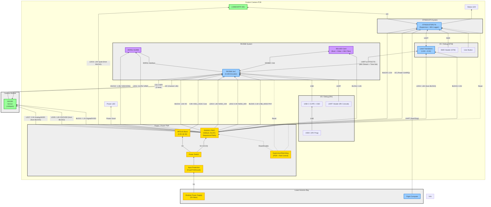

```mermaid
%%{init: {
 'themeVariables': { 'fontSize': '14px' },
 'flowchart': { 'padding': 10, 'nodeSpacing': 30, 'rankSpacing': 60, 'curve': 'linear' }
}}%%
graph BT
%% RK809-5 + MP2143 Power Rail Assignments (from Power Spec Rev. 1):
%% Buck Converters (High Efficiency Switching):
%%   MP2143: 0.9V (3000mA max) → RK3566 VDD_LOGIC (CPU/GPU/NPU core)
%%   BUCK1: 1.2V (2500mA max) → IMX290 Digital (DVDD)
%%   BUCK2: 1.35V (2500mA max) → DDR3L RAM VDD/VDDQ
%%   BUCK3: 2.2V (1500mA max) → LDO1/2/3/4/5 Input Rail
%%   BUCK4: 1.8V (1500mA max) → RK3566 VDD_IO + MicroSD
%%   BUCK5: 3.3V (2500mA max) → STM32U575 + RK3566 USB_AVDD + LDO7 Input
%% LDO Regulators (Low Noise Linear, all from RK809-5):
%%   LDO1: 0.675V (from BUCK3 2.2V, 400mA max) → DDR3L VREF
%%   LDO2: 0.9V (from BUCK3 2.2V, 400mA max) → RK3566 AVDD_0V9 (analog rails)
%%   LDO3: 1.8V (from BUCK3 2.2V, 100mA max) → LSM6DSRTR IMU (VDD + VDDIO)
%%   LDO4: 1.8V (from BUCK3 2.2V, 400mA max) → RK3566 AVDD_1V8 (analog rails) + Level Shifters (1.8V)
%%   LDO5: 1.8V (from BUCK3 2.2V, 400mA max) → IMX290 Sensor I/O (OVDD)
%%   LDO6: UNUSED
%%   LDO7: 2.9V (from BUCK5 3.3V, 400mA max) → IMX290 Sensor Analog (AVDD)
%%   LDO8: UNUSED
%%   LDO9: UNUSED
%%
%% IMX290 Sensor Power Requirements (3 rails):
%%   AVDD (2.9V): 83mA max active | 0.1mA standby
%%   OVDD (1.8V): 1mA max active | 0.1mA standby
%%   DVDD (1.2V): 118.5mA max active | 14mA standby

%% Top-level modules
subgraph CAM["Camera Module"]
  SENSOR["IMX290<br/>Sensor<br/>(1080p60)"]
end

subgraph LAB["Lower Avionics Bay"]
  MPS["Modular Power Supply<br/>(5V Main)"]
  FC["Flight Computer"]
end

subgraph PCB["Custom Camera PCB"]
  %% Power path
  subgraph POWER["Power / Power-Path"]
    INPROT["Input Protection<br/>(Fuse/TVS/Inrush)"]
    PWRSW["Power Switch"]
    PMIC["RK809-5 PMIC<br/>(5xBuck, 9xLDO,<br/>Sequenced Rails)"]
    MP2143BUCK["MP2143 Buck<br/>(0.9V @ 3A)"]
    SUPV["Supervisor/Watchdog<br/>(POR + Rail Control)"]
  end

  %% RK domain
  subgraph RK["RK3566 System"]
    RKSOC["RK3566 SoC<br/>(H.265 Encoder)"]
    RAM["DDR3L 512MB"]
    SDHOST["MicroSD Card<br/>(Boot + Video + IMU Files)"]
  end

  %% STM domain
  subgraph STM["STM32U575 System"]
    STMMCU["STM32U575RGT6<br/>(Supervisor + IMU Logger)"]
  end

  %% Sensors
  IMU["LSM6DSRTR IMU"]

  %% I/O and Debug
  subgraph CONNRK["I/O / Debug (RK)"]
    USBR["USB-C (RK Prog)"]
    USBCCTRL["USB-C CC/PD + ESD"]
    UARTH["UART Header (RK Console)"]
  end

  subgraph CONNSTM["I/O / Debug (STM)"]
    SWDH["SWD Header (STM)"]
    LVLSHIFT["Level Translators<br/>(1.8V↔3.3V)"]
    USRBTN["User Button"]
  end

  %% LEDs
  LED1["Power LED"]
  LED2["Status LED"]
end

%% → IMU
PMIC -->|"LDO3: 1.8V Quiet (from BUCK3)"| IMU
STMMCU <-->|"I2C"| IMU

%% → INPROT
MPS -->|"5V"| INPROT

%% → LED1
PMIC -->|"Power Good"| LED1

%% → LED2
STMMCU --> LED2

%% → LVLSHIFT
RKSOC <-->|"UART w/ RTS/CTS<br/>(IMU Stream + Time-Set)"| LVLSHIFT
PMIC -->|"LDO4: 1.8V (from BUCK3)"| LVLSHIFT
PMIC -->|"BUCK5: 3.3V"| LVLSHIFT

%% → MP2143BUCK
PWRSW -->|"5V"| MP2143BUCK

%% → PMIC
PWRSW -->|"5V (VCC9)"| PMIC
SUPV -.->|"Reset/Enable"| PMIC

%% → PWRSW
INPROT --> PWRSW

%% → RAM
PMIC -->|"BUCK2: 1.35V VDD/VDDQ"| RAM
PMIC -->|"LDO1: 0.675V VREF"| RAM
RKSOC ---|"DDR3L Interface"| RAM

%% → RKSOC
SENSOR -->|"CSI-2 MIPI<br/>(2-lane)"| RKSOC
SENSOR <-->|"I2C (Control 1.8V)"| RKSOC
PMIC -->|"BUCK4: 1.8V I/O"| RKSOC
MP2143BUCK -->|"0.9V VDD_LOGIC Core"| RKSOC
PMIC -->|"LDO4: 1.8V AVDD_1V8"| RKSOC
PMIC -->|"LDO2: 0.9V AVDD_0V9"| RKSOC
PMIC -->|"BUCK5: 3.3V USB_AVDD PHY"| RKSOC
SUPV -.->|"Reset"| RKSOC
USBCCTRL -->|"USB"| RKSOC
UARTH -->|"UART"| RKSOC

%% → SDHOST
RKSOC <-->|"SDMMC 4-bit"| SDHOST
PMIC -->|"BUCK4: 1.8V"| SDHOST

%% → SENSOR
PMIC -->|"LDO7: 2.9V Analog/AVDD (from BUCK5)"| SENSOR
PMIC -->|"LDO5: 1.8V I/O/OVDD (from BUCK3)"| SENSOR
PMIC -->|"BUCK1: 1.2V Digital/DVDD"| SENSOR

%% → STMMCU
PMIC -->|"BUCK5: 3.3V"| STMMCU
PMIC <-->|"I2C (Power Ctrl/IRQ)"| STMMCU
FC -->|"UART (Start/Stop)"| STMMCU
LVLSHIFT <-->|"UART"| STMMCU
SWDH -->|"SWD"| STMMCU
USRBTN --> STMMCU
SUPV -.->|"Reset"| STMMCU

%% → USBCCTRL
USBR -->|"USB"| USBCCTRL

%% Styling
classDef dataStyle fill:#99ccff,stroke:#0066cc,stroke-width:2px
classDef powerStyle fill:#ffdd00,stroke:#dd8800,stroke-width:2px
classDef storageStyle fill:#cc99ff,stroke:#6600cc,stroke-width:2px
classDef sensorStyle fill:#99ff99,stroke:#009900,stroke-width:2px
classDef subStyle fill:#eeeeee,stroke:#111111,stroke-width:2px

class PMIC,PWRSW,INPROT,SUPV,MPS,MP2143BUCK powerStyle
class STMMCU,RKSOC,FC,LVLSHIFT dataStyle
class SDHOST,RAM storageStyle
class SENSOR,IMU sensorStyle
class POWER,CONNRK,CONNSTM,RK,STM,LEDS,LAB,CAM,SENS subStyle
```
