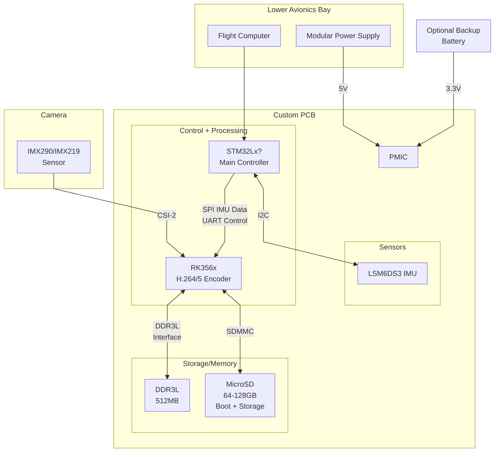

```mermaid
%%{init: {
    'themeVariables': {
        'fontSize': '14px'
    },
    'flowchart': {
      'padding': 10,
      'nodeSpacing': 30,
      'rankSpacing': 60,
      'curve': 'linear'
    }
}}%%

graph
    subgraph CAM["Camera"]
        SENSOR["IMX290/IMX219<br/>Sensor"]
    end

    subgraph LAB["Lower Avionics Bay"]
        MPS["Modular Power Supply"]
        FC["Flight Computer"]
    end
    
    BAT["Optional Backup<br/>Battery"]
    
    subgraph PCB["Custom PCB"]
        subgraph Sensors
            IMU["LSM6DS3 IMU"]
        end

        subgraph STOR["Storage/Memory"]
            RAM["DDR3L<br/>512MB"]
            SD["MicroSD<br/>64-128GB</br>Boot + Storage"]
        end

        subgraph CONTROL["Control + Processing"]
            RC["RK356x<br/>H.264/5 Encoder"]
            STM["STM32Lx?<br/>Main Controller"]
        end 

        PMIC
    end
    
    MPS -->|5V| PMIC
    FC --> STM
    SENSOR -->|CSI-2| RC
    
    
    RC <-->|DDR3L</br>Interface|RAM
    STM -->|SPI IMU Data </br> UART Control| RC
    
    RC <-->|SDMMC| SD
    STM <-->|I2C| IMU
    BAT -->|3.3V| PMIC
```