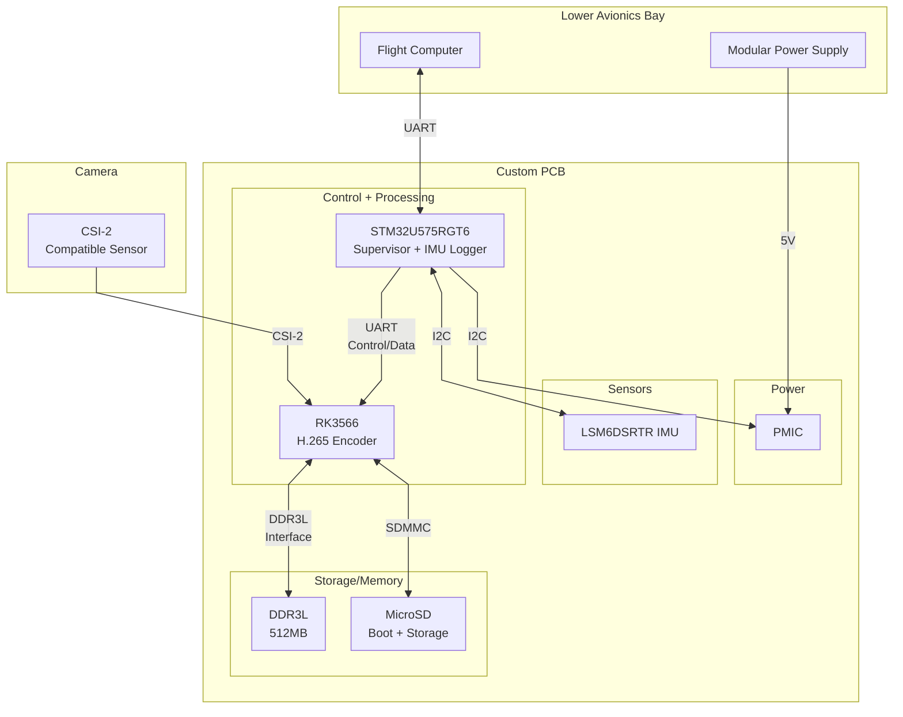

```mermaid
%%{init: {
    'themeVariables': {
        'fontSize': '14px'
    },
    'flowchart': {
      'padding': 10,
      'nodeSpacing': 30,
      'rankSpacing': 60,
      'curve': 'linear'
    }
}}%%

graph
    subgraph CAM["Camera"]
        SENSOR["CSI-2<br/>Compatible Sensor"]
    end

    subgraph LAB["Lower Avionics Bay"]
        MPS["Modular Power Supply"]
        FC["Flight Computer"]
    end

    subgraph PCB["Custom PCB"]
        subgraph POW["Power"]
            PMIC
        end

        subgraph Sensors
            IMU["LSM6DSRTR IMU"]
        end

        subgraph STOR["Storage/Memory"]
            RAM["DDR3L<br/>512MB"]
            SD["MicroSD<br/>Boot + Storage"]
        end

        subgraph CONTROL["Control + Processing"]
            RC["RK3566<br/>H.265 Encoder"]
            STM["STM32U575RGT6<br/>Supervisor + IMU Logger"]
        end

    end

    MPS -->|5V| PMIC
    FC <-->|UART| STM
    SENSOR -->|CSI-2| RC


    RC <-->|DDR3L</br>Interface|RAM
    STM -->|"UART</br>Control/Data"| RC

    RC <-->|SDMMC| SD
    STM <-->|I2C| IMU

    STM -->|I2C| PMIC
```