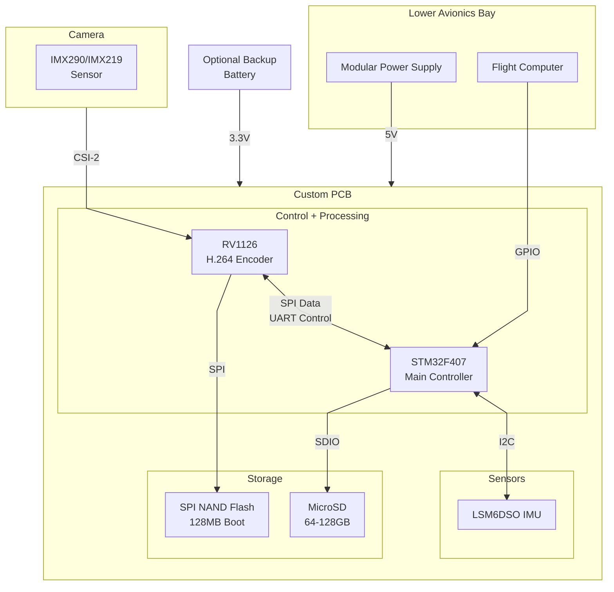

```mermaid
%%{init: {
    'themeVariables': {
        'fontSize': '14px'
    },
    'flowchart': {
      'padding': 10,
      'nodeSpacing': 30,
      'rankSpacing': 60,
      'curve': 'linear'
    }
}}%%

flowchart TB
    subgraph CAM["Camera"]
        SENSOR["IMX290/IMX219<br/>Sensor"]
    end

    subgraph LAB["Lower Avionics Bay"]
        MPS["Modular Power Supply"]
        FCMCU["Flight Computer"]
    end
    
    BATT["Optional Backup<br/>Battery"]
    
    subgraph PCB["Custom PCB"]
        subgraph Sensors
            IMU["LSM6DSO IMU"]
        end

        subgraph Storage
            NAND["SPI NAND Flash<br/>128MB Boot"]
            SD["MicroSD<br/>64-128GB"]
        end

        subgraph CONTROL["Control + Processing"]
            RC["RV1126<br/>H.264 Encoder"]
            STM["STM32F407<br/>Main Controller"]
        end 
    end
    
    MPS -->|5V| PCB
    BATT -->|3.3V| PCB
    FCMCU -->|GPIO| STM
    
    
    RC -->|SPI| NAND
    RC <-->|SPI Data </br> UART Control| STM
    
    STM -->|SDIO| SD
    STM <-->|I2C| IMU
    CAM -->|CSI-2| RC
```